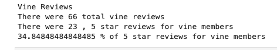
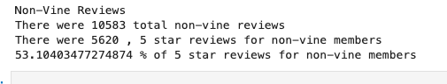

# Amazon Vine Analysis

## Overview of the analysis
* The purpose of this analysis was to determine if there was any bias toward favorable reviews from Vine members in our dataset.

## Results
* Here are the results we got from the vine reviews.

* Here are the results we got from the non-vine reviews.

## Summary

* We found that 35% of reviews for vine members were 5 star.
* 53% of non-vine members left a 5 star review.
* We can conclude that non-vine members are more likely to leave a 5 star in comparison to vine members.
* This makes sense because vine members have to leave a review, which makes it more difficult to receive 5 stars.
* One additional analysis that we could do with the dataset to support our statement would be to filter the one star reviews and see what the numbers would look like for vine and non-vine members.